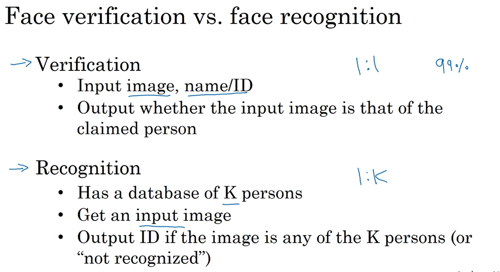
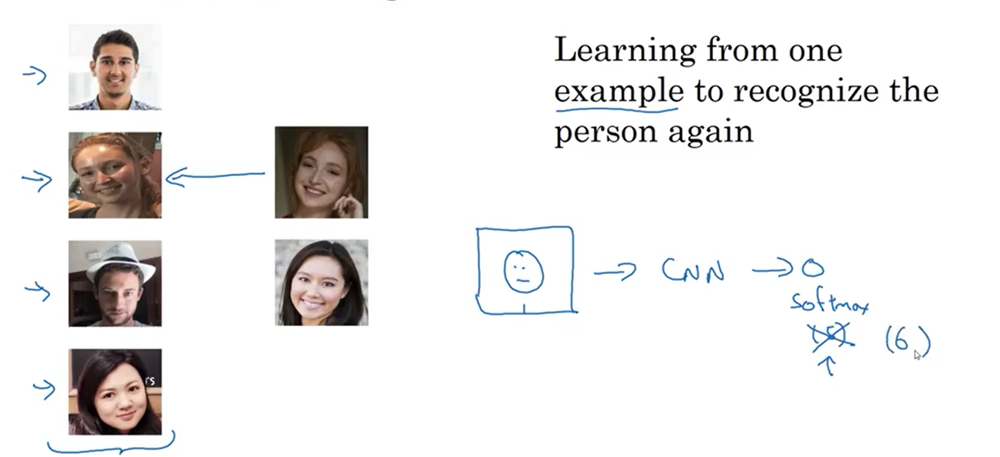
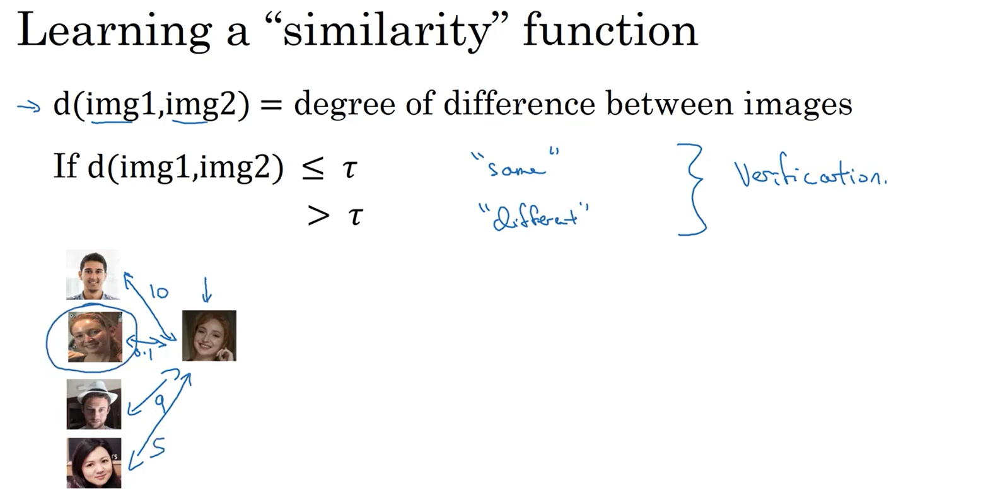
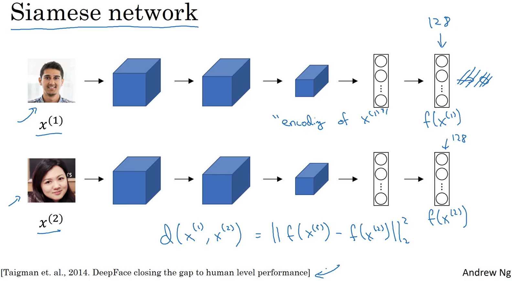
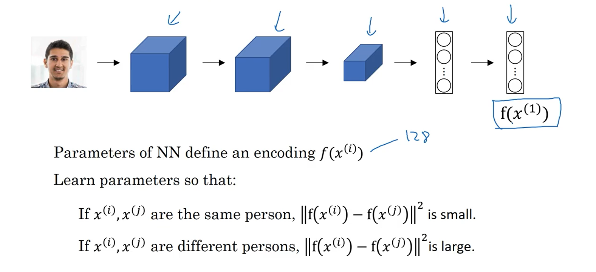
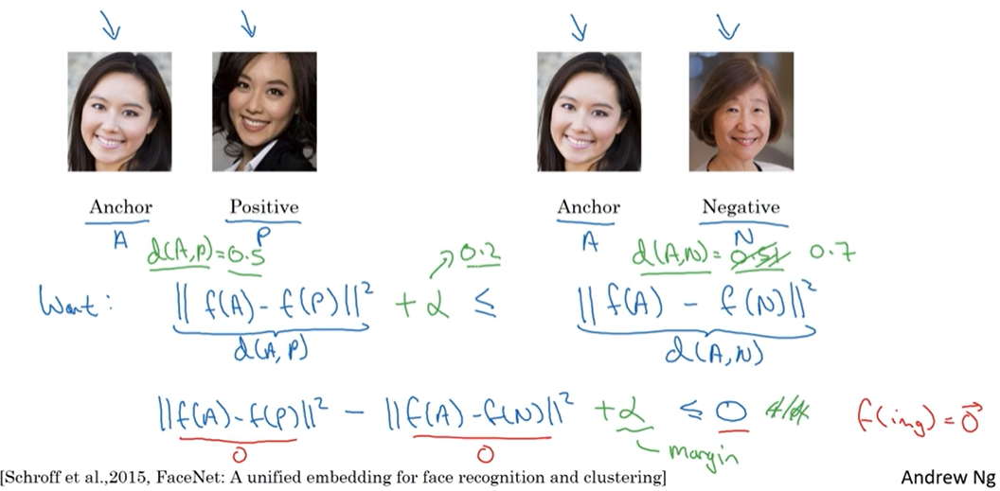
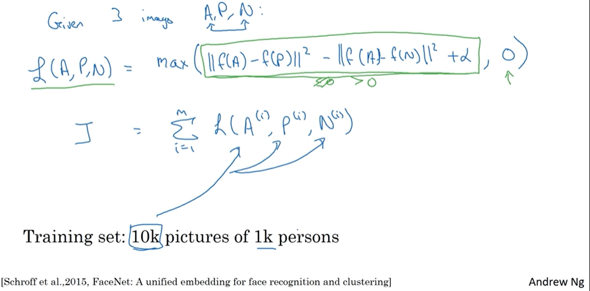

# face_recognition
In this project, will learn the concept to implement face recognition problem.

## Teminology Use In Face Recognition

## One-shot Learning 

To do that we must use **Similarity function**

## Siamese network

## Goal Of Learning

## Triplet Loss 

## Training Triplet Loss

